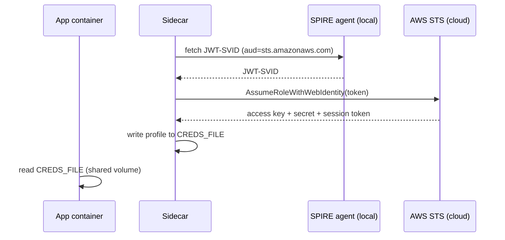
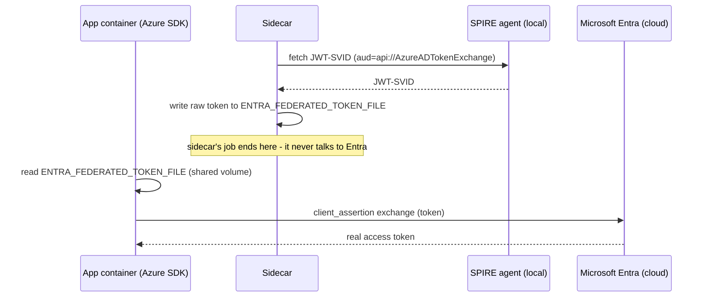
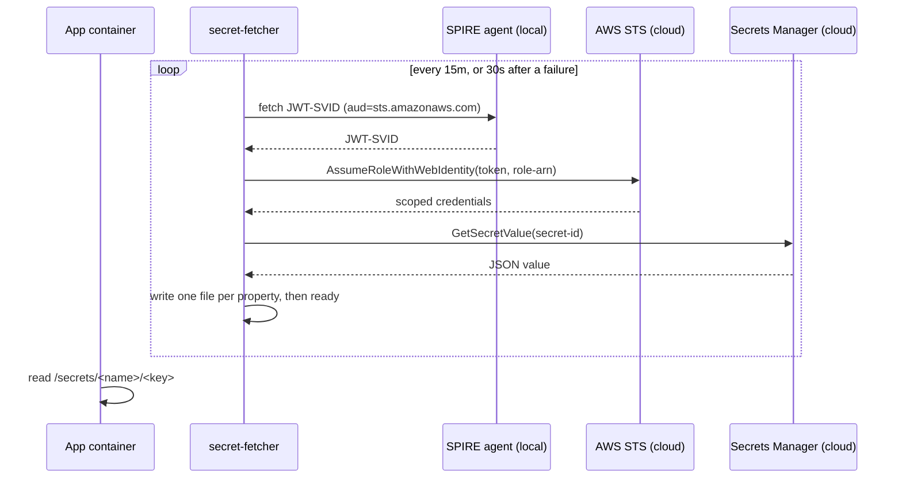

# workload-identity-sidecar

Sidecar container that exchanges a [SPIFFE](https://spiffe.io/) SVID for short-lived cloud credentials via OIDC federation. The [XApi](https://github.com/cujarrett/homelab/tree/main/platform/api) Crossplane composition injects this sidecar into pods that declare cloud resource bindings.

## How it works

Every pod running on this cluster gets a short-lived [SPIFFE JWT-SVID](https://spiffe.io/docs/latest/spiffe-about/spiffe-concepts/#svid) from the SPIRE agent. Think of it as a cryptographic identity badge for the pod - it proves *which workload* is running without any passwords or API keys.

When an app needs AWS credentials (e.g. to talk to S3 or DynamoDB), the XApi Crossplane composition adds this sidecar to the pod alongside the app. The sidecar:

1. Waits for the SPIFFE Workload API socket to be available at startup
2. Asks this cluster's own SPIRE agent for a JWT-SVID, over that socket - a purely local call, nothing leaves the cluster yet
3. Presents that token to AWS STS via `sts:AssumeRoleWithWebIdentity`, once per binding - this is the first point AWS is contacted, and the only place the token itself ever leaves the cluster
4. Receives short-lived STS credentials (access key + secret + session token) in return
5. Writes those credentials into a shared file as named profiles - one per AWS binding
6. Sleeps 50 minutes, then repeats (credentials expire after 1 hour)



`sts:AssumeRoleWithWebIdentity` needs no request signing, because the token is itself the credential. AWS verifies it by fetching the signing keys from the OIDC issuer published by the cluster and checking the signature, the `sub` claim and the `aud` claim. That is why the exchange is a plain HTTPS POST, made with `curl`.

The app container reads credentials from that shared file. It never handles the token, calls AWS directly for credentials, or stores any long-lived secrets.

If a binding's files aren't readable yet or an exchange fails (AWS throttle, transient network blip), the sidecar keeps the previous credentials file untouched - it's still valid for up to an hour - and retries the whole cycle in 30 seconds instead of crashing.

### Entra

Entra needs no exchange call in this sidecar at all - the Azure SDK's `WorkloadIdentityCredential` does the `client_assertion` swap itself, on demand, the same contract Azure Kubernetes Service (AKS) uses natively. This sidecar's only job is keeping one file - `ENTRA_FEDERATED_TOKEN_FILE` - holding a fresh, unexchanged SVID:

1. Asks this cluster's own SPIRE agent for a JWT-SVID - the same local call the AWS loop makes, just requesting the audience `api://AzureADTokenExchange` instead of `STS_AUDIENCE`. Entra is not contacted here; this step is entirely local to the cluster.
2. Writes that token as-is to `ENTRA_FEDERATED_TOKEN_FILE`. No exchange happens yet - Entra only sees this token later, when the app's own SDK presents it.
3. Repeats every `ENTRA_REFRESH_INTERVAL` seconds (default 240) to stay ahead of SPIRE's 5-minute JWT-SVID expiry.



The app container's Azure SDK reads `AZURE_CLIENT_ID`, `AZURE_TENANT_ID` and `AZURE_FEDERATED_TOKEN_FILE` - all three injected by the XApi composition - and exchanges the token for a real access token itself, whenever it needs one. This sidecar never sees that access token.

### Secrets

A secret is a value, not a service, so this loop delivers the value itself as files. `secret-fetcher`, a Go binary in this image, runs it:

1. Reads `role-arn`, `secret-id` and `region` from each binding directory named in `SECRET_BINDINGS`
2. Fetches its own JWT-SVID and calls `AssumeRoleWithWebIdentity`, one role per binding, the same trust model as the AWS loop
3. Calls `GetSecretValue` and writes each property of the JSON value as its own file in the binding's output directory, atomically and read-only, then a `ready` file last
4. Repeats every 15 minutes so a rotated value lands without a pod restart; a failed fetch leaves existing files untouched and retries in 30 seconds

A secret created but never given a real value holds a platform-written placeholder. The fetcher recognizes it and writes nothing, logging why. It writes whatever properties the value does carry, so an app is responsible for checking that the ones it needs are there.



An Api can set any combination of `AWS_BINDINGS`, `ENTRA_FEDERATED_TOKEN_FILE`, and `SECRET_BINDINGS` - all three loops run independently and concurrently when configured.

## Platform context

This helper is the runtime component that connects the pieces of my [platform](https://github.com/cujarrett/homelab/tree/main/platform) together:

- **Crossplane** provisions AWS resources and IAM roles.
- **SPIRE** proves the workload's identity with a SPIFFE SVID.
- **This helper** exchanges that identity for temporary AWS credentials.
- **The AWS SDK** consumes those credentials transparently on a resource binding. On a secret binding this helper spends them itself and hands the app files.

That separation is what makes the developer experience clean: developers declare that they need an AWS capability, while the platform handles identity, authorization, credential acquisition, and rotation behind the scenes.

## Environment variables

| Variable | Description |
|---|---|
| `AWS_BINDINGS` | Comma-separated `mountPath:profile` pairs (e.g. `/bindings/object-storage:object-storage,/bindings/nosql:nosql`) |
| `CREDS_FILE` | Output path for the AWS credentials file (e.g. `/aws-credentials/credentials`) |
| `STS_AUDIENCE` | Audience requested for the JWT-SVID, default `sts.amazonaws.com`. Must match a client id registered on the AWS OIDC identity provider, or STS rejects the token. |
| `STS_ENDPOINT` | STS endpoint, default `https://sts.us-east-1.amazonaws.com`. Regional because the mesh egress allowlist permits only that host. |
| `ENTRA_FEDERATED_TOKEN_FILE` | Output path for the raw Entra JWT-SVID (e.g. `/entra-identity/token`). Setting this enables the Entra loop. |
| `ENTRA_AUDIENCE` | Audience requested for the Entra JWT-SVID, default `api://AzureADTokenExchange`. Fixed by Microsoft. |
| `ENTRA_REFRESH_INTERVAL` | Seconds between Entra token refreshes, default `240`. |
| `SECRET_BINDINGS` | Comma-separated `bindingDir:outputDir` pairs (e.g. `/bindings/managed-secret-orders:/secrets/orders`). Two paths because the binding is a read-only Secret volume and the fetched value needs somewhere writable to land. Setting this enables the secret loop. |
| `SPIFFE_SOCKET` | Workload API socket path used by the secret loop, default `/var/run/secrets/spiffe.io/api.sock`. |

## Volumes expected

| Mount | Contents |
|---|---|
| `/var/run/secrets/spiffe.io/` | SPIFFE Workload API socket (`api.sock`), provided by the SPIFFE CSI driver. The sidecar fetches a JWT-SVID from it each cycle. |
| Each binding `mountPath` | `role-arn` from the Crossplane binding Secret |
| `dirname($CREDS_FILE)` | Writable emptyDir shared with app containers |
| `dirname($ENTRA_FEDERATED_TOKEN_FILE)` | Writable emptyDir shared with app containers |
| Each `SECRET_BINDINGS` binding dir | `role-arn`, `secret-id` and `region` from the Crossplane binding Secret, read-only |
| Each `SECRET_BINDINGS` output dir | Writable emptyDir shared with app containers, where the value's properties are written one file per key |

## Credentials file format

```ini
[object-storage]
aws_access_key_id = REDACTED
aws_secret_access_key = REDACTED
aws_session_token = REDACTED

[nosql]
aws_access_key_id = REDACTED
aws_secret_access_key = REDACTED
aws_session_token = REDACTED
```

App containers point `AWS_SHARED_CREDENTIALS_FILE` at this file and select a profile via `AWS_PROFILE_<BINDING>` env vars - both injected by the XApi composition.

## Image

```
ghcr.io/cujarrett/workload-identity-sidecar:main
```

Built by CI on every push to `main`. ARM64 only (Raspberry Pi 5 nodes).

## Updating binaries

Renovate opens a PR when SPIRE cuts a release, tracking `SPIRE_VERSION` in `sidecar/Dockerfile`. The PR carries a reminder to check it against the cluster's running version before merging.
